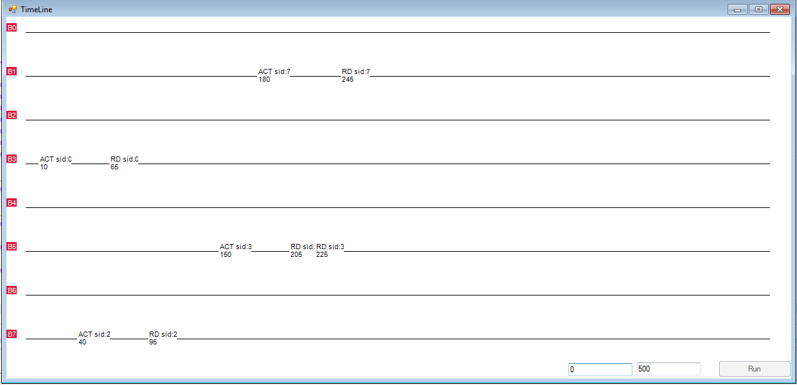
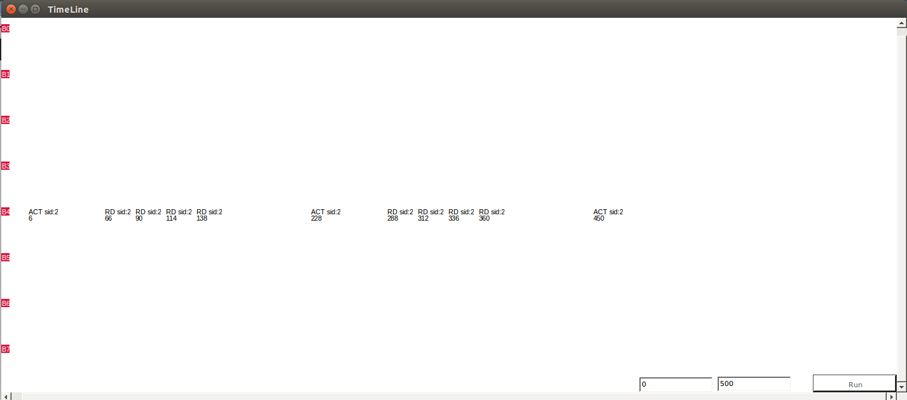

## Ramulator#: A fast and lightweight DRAM simulator

Ramulator# (pronounced as ramulator sharp) is a fast and flexible memory
subsystem simulator implemented in C# and it can easily run on Linux, OS X, and
Windows. The simulator contains the implementation of a wide array of
commercial, as well as academic, DRAM standards. It is a predecessor of
[Ramulator](https://github.com/CMU-SAFARI/ramulator). Therefore, the high-level
design Ramulator# is very similar to that of Ramulator. The main difference is
that it is implemented in the C# language whereas Ramulator is written in C++.
To understand how Ramulator# models a DRAM-based memory system, we refer the
readers to the original
[article](https://users.ece.cmu.edu/~omutlu/pub/ramulator_dram_simulator-ieee-cal15.pdf)
that provides further details on the design.

**DDR Standards**

Ramulator# can be configured to run with an array of DDR3 and
LPDDR3 standards (`src/Mem/DDR3DRAM.cs`). Additional standards can be easily
added to Ramulator#.


**Academic Proposals**

Ramulator# supports many recent academic proposals:
- [Low-Cost Inter-Linked Subarrays (LISA): Enabling Fast Inter-Subarray Data Movement in 
  DRAM](https://users.ece.cmu.edu/~omutlu/pub/lisa-dram_hpca16.pdf)
by Chang et al. in HPCA 2016.
- [ChargeCache: Reducing DRAM Latency by Exploiting Row Access
  Locality](https://users.ece.cmu.edu/~omutlu/pub/chargecache_low-latency-dram_hpca16.pdf)
by Hassan et al. in HPCA 2016.
- [The Blacklisting Memory Scheduler: Achieving High Performance and Fairness at
  Low
Cost](https://users.ece.cmu.edu/~omutlu/pub/bliss-memory-scheduler_iccd14.pdf)
by Subramanian et al. in ICCD 2014.
- [RowClone: Fast and Energy-Efficient in-DRAM Bulk Data Copy and
  Initialization](https://users.ece.cmu.edu/~omutlu/pub/rowclone_micro13.pdf)
by Seshadri et al. in MICRO 2013.
- [A Case for Exploiting Subarray-Level Parallelism (SALP) in
  DRAM](https://users.ece.cmu.edu/~omutlu/pub/salp-dram_isca12.pdf) by
Kim et al. in ISCA 2012.
- [Thread Cluster Memory Scheduling: Exploiting Differences in Memory Access
  Behavior](https://users.ece.cmu.edu/~omutlu/pub/tcm_micro10.pdf)
by Kim et al. in MICRO 2010.
- [ATLAS: A Scalable and High-Performance Scheduling Algorithm for Multiple
  Memory Controllers](https://users.ece.cmu.edu/~omutlu/pub/atlas_hpca10.pdf)
by Kim et al. in HPCA 2010.
- [Parallelism-Aware Batch Scheduling: Enhancing both Performance and Fairness
  of Shared DRAM Systems]
(https://users.ece.cmu.edu/~omutlu/pub/parbs_isca08.pdf) by Mutlu et al. in ISCA
2008.


## Getting Started

By default, Ramulator# uses [Mono](http://www.mono-project.com/) (an
open-source implementation of Microsoft's .NET framework) for compilation and
runtime on the installed system. It has been tested on Windows, Linux, and OS
X. Users can also choose to use Visual Studio as the development tool.

**Installation and Compilation**
```sh
$ git clone [RamulatorSharp-repo-url]
$ cd RamulatorSharp; make
```

If the compilation completes without errors, the binary is located in `bin/sim.exe`.

**Running Ramulator#?**

To run some sample simulations:
```sh
$ ./test_runs.sh
```

The script provides examples on running various system configurations, such as
a single-core system to a quad-core system with different memory configurations.
It generates results in the json format under the folder `results`.

**Configuring Ramulator#**

Ramulator# can be easily run with various configurations. Academic proposals and
other DRAM standards can be selected using a simple configuration file (.cfg).
We provide sample configuration files inside the ``configs/`` folder which
demostrate the usage of LISA and ChargeCache mechanisms.

**How does Ramulator# simulate an application?**

At a high level, Ramulator# simulates a core running a single application by
consuming a trace. A trace consists of a list of memory requests and number of
CPU instructions generated from an actual application running on a real system.
We provide several sample traces collected from real applications running on a
real Linux system. They locate under `traces`. In a trace file, each line
represents a memory request with the following format:

`<num-cpuinst> <addr-read> <addr-writeback>`: The line has three tokens. The
first token represents the number of CPU (i.e., non-memory) instructions before
the memory request, and the second token is the decimal address of a *read*.
The third token is the decimal address of the *writeback* request, which is the
dirty cache-line eviction caused by the read request before it. Note the memory
requests in our traces refer to cache miss requests generated from the L2 cache.

Ramulator# consumes a workload file through the `-workload` flag. A workload
file contains a list of traces to run and a workload means a set of
applications to run on the system. Each line specifies a particular workload to
run, which can consist of one to many trace file names. The number of trace
files written on each line essentially represents the number of applications or
cores to run. For example, in `workloads/4core_mix`, the second line shows
`trace.forkset-rc.gz trace.bootup.1B-rc.gz tpcc64.gz 462.libquantum.gz`, which
has 4 different trace file names. This means that the simulator should be
configured with 4 cores (using `-N 4`) to consume these 4 traces. It is also
the first workload in the trace file. As the first line of the file specifies
the locations where the trace files locate. So by specifying `-workload
workloads/4core_mix 1`, the simulator simulates the first workload (line 2) in
the trace file.

## GUI support for visualizing DRAM command sequence

Ramulator# provides a nice GUI tool to visual DRAM commands sent from the
memory controller to the various DRAM structures (i.e., channels, ranks, and
    banks). The authors have found it extremely useful for debugging or
understanding the performance of implementations that can affect the ordering
of the commands. The following two image are the screenshot from using the GUI
tool to show the commands that have been issued to the 8 different DRAM banks
within a specific channel and rank.

# 
# 

To enable the GUI tool, add the flag ``-gfx.gui_enabled true`` to the running command or to the config file. The GUI tool works on both Windows and Linux, but is not rendering properly on OS X at the momemnt.

## Contributors

- [Kevin Chang](https://users.ece.cmu.edu/~kevincha/)
- [Yoongu Kim](https://users.ece.cmu.edu/~yoonguk/)

## License

Released under a BSD (3-clause) license
